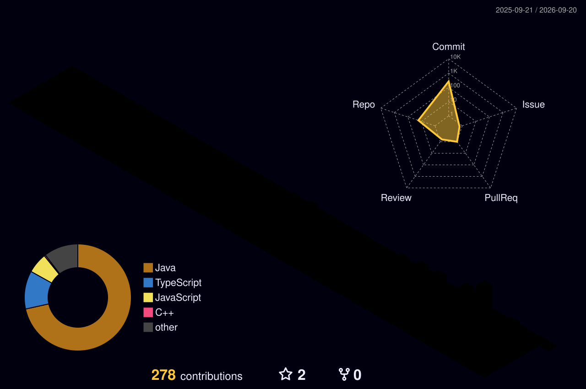

# <div align="center"> 


 
<br/>


<a href="https://prajwal-portfoilio.vercel.app/">

</a>

<a href="https://linkedin.com/in/prajwal-karajange">

</a>

<a href="mailto:prajwalkarajange0409@gmail.com">

</a>

<a href="https://github.com/prajwalkarajange">

</a>

<br/>


</div>

---

# 👨‍💻 About Me

I'm a **Java Full Stack Developer** passionate about designing and developing scalable software solutions that combine modern web technologies with Artificial Intelligence.

My expertise includes **Spring Boot, React.js, TypeScript, MySQL, PostgreSQL, REST APIs, Docker, and Generative AI**, with practical experience building production-ready applications, enterprise systems, and AI-powered platforms.

Currently working as a **Software Engineer Intern at CloseKart**, I focus on building maintainable software, improving application performance, and developing reusable components that follow clean coding principles.

Outside development, I represent **Google's Gemini AI Program** as a **Google Student Ambassador** and serve as a **GeeksforGeeks Campus Mantri**, helping students explore software engineering and AI technologies.

🚀 I'm always excited to build impactful products, contribute to innovative ideas, and collaborate on challenging software engineering projects.

### Open To

* Software Engineering Internships
* Full Stack Development Roles
* AI / ML Projects
* Open Source Contributions
* Research Collaborations
* Product Engineering Opportunities

---

# 💻 Tech Stack

<div align="center">

## 👨‍💻 Programming Languages


<br><br>

## 🎨 Frontend Development


<br><br>

## ⚙️ Backend Development


<br><br>

## 🗄️ Database & ORM


<br><br>

## ☁️ DevOps & Development Tools


<br><br>

## 🤖 AI & Cloud Technologies


<br>


<br><br>

## 📚 Computer Science Fundamentals


</div>

---


# 🚀 Featured Projects

<details open>
<summary><b>🧵 ThreadCounty – AI Powered Textile Intelligence Platform</b></summary>

### AI-Powered SaaS Platform for Fabric Analysis

| Category | Details |
|-----------|---------|
| **Tech Stack** | React.js • TypeScript • Supabase • Gemini AI • Vercel |
| **Architecture** | SaaS • Authentication • Dashboard • Cloud Deployment |
| **Key Features** | AI Fabric Analysis, PDF Reports, Upload History, Analytics Dashboard |
| **Impact** | Automated fabric quality inspection workflow by **85%** |
| **Live Demo** | Add Live Link |
| **Repository** | Add GitHub Link |

#### Highlights

- 🤖 AI-powered fabric analysis using **Google Gemini AI**
- 🔐 Secure authentication with **Supabase Auth**
- 📊 Interactive analytics dashboard
- 📄 Automated AI report generation with PDF export
- ☁️ Fully deployed on **Vercel**
- 📱 Responsive modern UI built with React & TypeScript

</details>

---

<details>
<summary><b>💼 Enterprise Job Portal Platform</b></summary>

### Full Stack Recruitment Management System

| Category | Details |
|-----------|---------|
| **Tech Stack** | Java • Spring Boot • JPA • Hibernate • MySQL • Docker |
| **Architecture** | REST APIs • Layered Architecture • MVC |
| **Key Features** | CRUD Operations, Authentication, Job & Applicant Management |
| **Impact** | Reduced manual recruitment workflow by **80%** |
| **Live Demo** | Add Live Link |
| **Repository** | Add GitHub Link |

#### Highlights

- ⚙ Built using **Spring Boot** and **Hibernate**
- 🔗 RESTful API architecture
- 🗄 Database integration with MySQL
- 🐳 Dockerized deployment
- 📦 Maven-based project structure
- ☁ Cloud deployed application

</details>

---

<details>
<summary><b>🔐 SecureVault – Enterprise Password Manager</b></summary>

### Secure Credential Management System

| Category | Details |
|-----------|---------|
| **Tech Stack** | Java • MySQL • AES-256 Encryption • RBAC |
| **Architecture** | Secure Authentication • Encryption • Role-Based Access |
| **Key Features** | Credential Management, Password Generator, Secure Storage |
| **Impact** | Reduced unauthorized access risk by **90%** |
| **Repository** | Add GitHub Link |

#### Highlights

- 🔒 AES-256 encrypted credential storage
- 👥 Role-Based Access Control (RBAC)
- 🔑 Secure authentication system
- ⚡ Optimized MySQL database queries
- 🛡 Enterprise-grade security practices

</details>

# 💼 Professional Experience

## 💻 Software Engineer Intern | CloseKart

**📅 Jun 2026 – Present**  
**📍 Remote**

> Contributing to the development of scalable web applications using Java and React while collaborating with cross-functional teams to deliver production-ready features.

### 🚀 Key Contributions

- Developed **10+ reusable React.js components** to improve UI consistency and maintainability.
- Built backend modules using **Java, Servlets, JSP, and MySQL**.
- Implemented new features, fixed bugs, and optimized application performance.
- Collaborated using **Git & GitHub** following clean coding and version control practices.
- Participated in debugging, testing, and code reviews to ensure software quality.

**🛠 Tech Stack**

`Java` `React.js` `Servlets` `JSP` `MySQL` `Git` `GitHub`

---

## ⚙️ Software Development Intern | Code Tech IT Solution

**📅 Apr 2025 – May 2025**  
**📍 Remote**

> Worked on system-level software projects with a focus on performance optimization, multithreading, and efficient file processing.

### 🚀 Key Contributions

- Developed a **Multithreaded File Compression Tool** in C++.
- Optimized file handling and processing using multithreading concepts.
- Applied **Object-Oriented Programming** principles and efficient algorithms.
- Performed debugging, testing, and code optimization.
- Used Git for version control and collaborative development.

**🛠 Tech Stack**

`C++` `Multithreading` `OOP` `File Handling` `Git`

---

## 🤖 Google Student Ambassador – Gemini AI Program | Google

**📅 Feb 2026 – Present**  
**📍 Remote**

> Selected to represent Google's Gemini AI initiatives and promote AI awareness within the student developer community.

### 🚀 Responsibilities

- Organized AI awareness sessions and technical initiatives.
- Promoted **Google Gemini AI** and Generative AI technologies.
- Mentored students interested in AI and software development.
- Built technical communities through workshops and events.
- Encouraged adoption of modern AI development practices.

**🛠 Skills**

`Generative AI` `Gemini AI` `Leadership` `Community Building` `Public Speaking`

---

# Achievements

<div align="center">

| Recognition                      | Details                                                  |
| -------------------------------- | -------------------------------------------------------- |
| 🏆 University Topper             | Highest academic performance across engineering branches |
| 🏆 Department Topper (IT)        | Ranked #1 in Information Technology Department           |
| 🚀 Hackathon Finalist            | Recognized for innovation and engineering excellence     |
| 🥇 Codex Java Competition Winner | Competitive programming and software design excellence   |
| 🌟 Google Student Ambassador     | Selected for Gemini AI Program                           |

</div>

---

# Certifications

### AWS


### Oracle


### NPTEL


### Cisco


---

# Coding Profiles

<p align="center">

<a href="https://leetcode.com">

</a>


<a href="https://www.hackerrank.com">

</a>


</p>

---

# GitHub Analytics

<div align="center">


</div>

## 🏆 Developer Insights

<p align="center">
  
</p>

---

# Contribution Activity

<div align="center">


</div>


---

# 🌍 3D Contribution Calendar

<p align="center">
  
</p>

---

## 🐍 Contribution Snake

<p align="center">
  <picture>
    <source media="(prefers-color-scheme: dark)"
      srcset="https://cdn.jsdelivr.net/gh/prajwalkarajange/prajwalkarajange@output/github-snake-dark.svg">
    <source media="(prefers-color-scheme: light)"
      srcset="https://cdn.jsdelivr.net/gh/prajwalkarajange/prajwalkarajange@output/github-snake.svg">
    
  </picture>
</p>

---

# 🎯 Current Focus

```yaml
Learning:
  - System Design
  - Microservices Architecture
  - Cloud Computing
  - Large Language Models (LLMs)

Building:
  - Enterprise Java Applications
  - AI-Powered Web Applications
  - Full Stack SaaS Platforms

Exploring:
  - Generative AI
  - Scalable Backend Systems
  - DevOps & Cloud Deployment

Open_To:
  - Software Engineer Roles
  - Java Full Stack Developer Opportunities
  - AI & Backend Engineering
  - Innovative Product Development
```

# Connect

<p align="center">

<a href="mailto:prajwalkarajange0409@gmail.com">

</a>

<a href="https://linkedin.com/in/prajwal-karajange">

</a>

<a href="https://github.com/prajwalkarajange">

</a>

<a href="https://prajwal-portfoilio.vercel.app/">

</a>

</p>

---

<div align="center">

*"Engineering scalable solutions, building intelligent systems, and creating impact through technology."*

</div>


